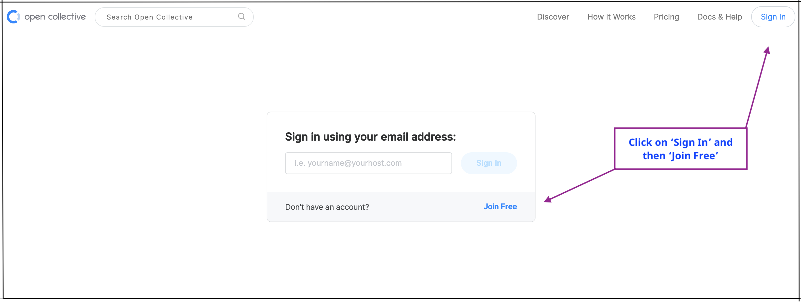
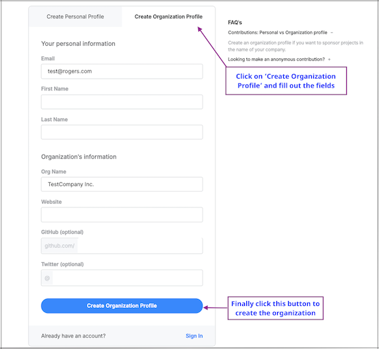

# Setting up an Organization

In this section, you will learn how to
* Create an Organization
* Edit an Organization
* View an Organization's Subscription

Click on the image below to watch a video about setting up organizations or if you prefer to read the guide instead, keep scrolling down.

**What is an organization and why create one?**

An organization represents a legal entity (as opposed to an individual). You'll want to create an organization on Open Collective if:
* You want to sponsor a Collective (project) in the name of your company
* You want your employees to support Collectives on your company's behalf
* You want to do bulk transfers (send money once and then distribute it to as many Collectives as you wish)
* You want to become a Fiscal Host for a Collective

## Creating an Organization

1. If you don't have a profile already set up in Open Collective, click on the 'Sign In' button on the top right corner and then click the blue 'Join Free' link.
  

2. Click on 'Create Organization Profile'. Fill out the relevant details and click the blue  button.
 

3. If you already have a profile set up on Open Collective, click on your profile name in the top right corner and click the 'New' button next to 'My Organizations'. 
   
   
   
   
4. You will be taken to a page where you can fill out the fields to create a new organization to add to your profile. Finally click the blue   button to save all changes.
  

## Editing an Organization

1. After creating the organization, you will be taken to a screen where you can edit your profile. Click on the 'Edit Organization' button.
  

2. You can now edit the following information:
* **Info**: Company's name, description, Twitter URL, company website etc.
* **Images**: Logo and cover image
* **Members**: Add organization members
* **Payment methods**: View, edit and change payment methods (credit cards), and set a monthly spending limit
* **Advanced**: change your Organization's URL

Finally, click on the blue  button.
  

